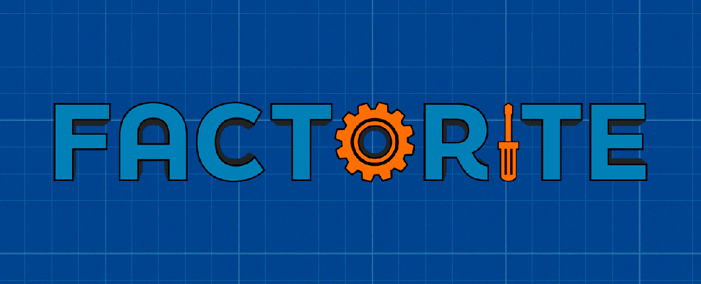
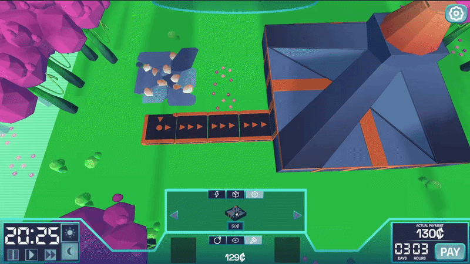
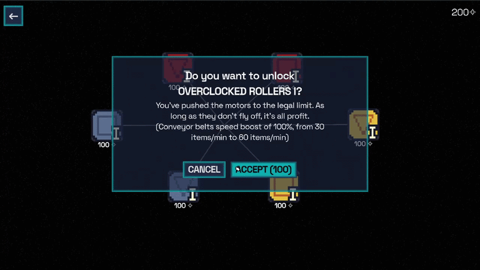
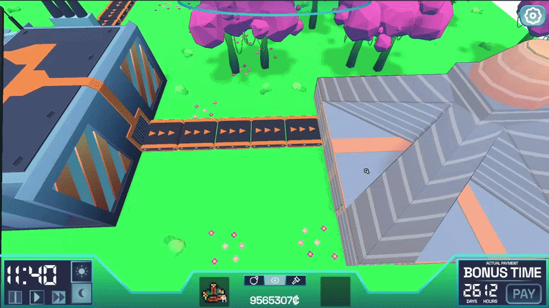
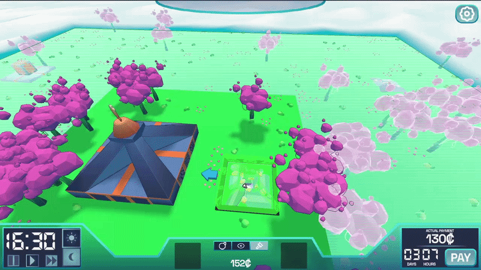
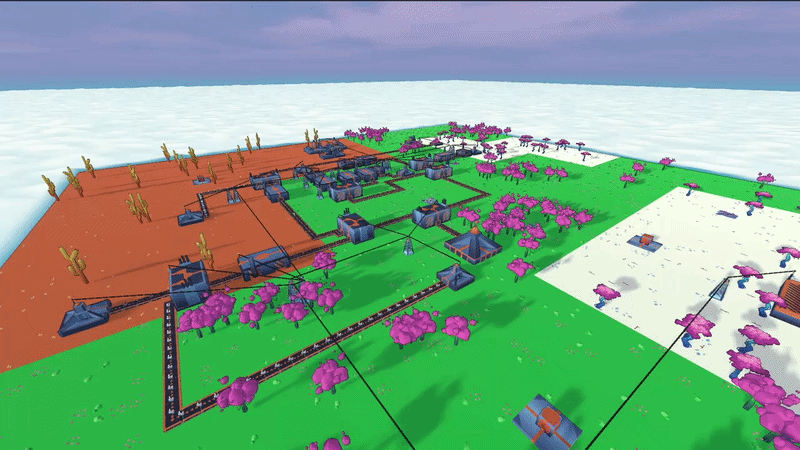

  

<h1 align="center">Factorite: Automation & Roguelite Video Game</h1>

  <strong>Bachelor's Thesis — Degree in Multimedia Engineering</strong> 
  Developed in <strong>Godot Engine 4.5 (C#)</strong> by <strong>Alejandro Díaz Alcaraz</strong>

  
  
  
  
  

---

## 📌 Project Overview

**Factorite** is a 3D top-down PC video game that merges two popular indie genres: **industrial automation** and **roguelite mechanics**. 

Players assume the role of a space colonist sponsored by the *Gammazon* corporation. After acquiring a small dwarf planet on an installment plan, your core objective is to harvest natural resources, build and optimize automated production chains, and clear a debt divided into **7 progressive payments** before daily deadlines. Completing all payments grants you full ownership of the planet; failing to do so results in eviction into deep space.

  

---

## 📥 Quick Play (Pre-compiled Release)

If you want to test the game directly without compiling:

1. Go to the **[Latest Release](../../releases/latest)** section on GitHub.
2. Download the `.zip` package.
3. Extract the ZIP contents to any folder.
4. Launch `Factorite.exe` to play.

---

## ✨ Key Features

* **Procedural World Generation:** 7x7 chunk grid world generation with realistic biome distributions (forest, meadow, desert, and snow) using pseudo-random noise algorithms (*FastNoiseLite*).
* **Modular Automation Systems:** 
  * **12 distinct machine types** categorized into Production (Extractors, Furnaces, Refineries, Assemblers), Logistics (Conveyors, Mergers, Splitters, Selling Stations), and Energy (Biomass Generators, Coal Plants, Solar Panels, and Nuclear Reactors).
  * Push-based item transfer logic across interconnected machine inventories (`LogicGrid`).
  * Independent power grids featuring real-time load balancing between power plants, consumers, and transmission poles.
* **Dynamic Reactive Market:** Item sale values fluctuate after every payment phase based on player supply/demand metrics and technological advancement.
* **In-Game Upgrade Chips:** Over 14 equipable improvement chips with variable rarity tiers (Common, Rare, Epic) that modify machine behavior during a run.
* **Persistent Metaprogression (Skill Tree):** 
  * Earn metaprogression points upon completing runs.
  * Persistent skill tree stored in JSON format with 3 interconnected branches: **Economic**, **Logic**, and **Handyman**.

---

## 📸 Screenshots

| Skill Tree | Market UI |
| :---: | :---: |
|  |  |

| Building System | Chunk Generation |
| :---: | :---: |
|  |  |

---

## 🛠️ Tech Stack & Tools

| Component | Technology / Software |
| :--- | :--- |
| **Game Engine** | Godot Engine 4.5 (Mono / C#) |
| **Programming Language** | C# (.NET) |
| **Procedural Generation** | FastNoiseLite |
| **3D Modeling & Texturing** | Blender (Low-Poly Aesthetic) |
| **2D Art & Sprites** | Aseprite (16x16 Pixel Art) |
| **UI Vector Design** | Inkscape & GIMP |
| **Project Management** | Scrumban (Trello + Clockify) |

---

## 🎮 Controls & Inputs

| Action | Key / Input | Description |
| :--- | :--- | :--- |
| **Camera Movement** | `W`, `A`, `S`, `D` / Arrow Keys | Pan camera across the map |
| **Zoom** | Mouse Wheel | Zoom in / Zoom out |
| **Camera Rotation** | Middle Mouse Click + Drag | Rotate 3D camera orientation |
| **Inspect Tool** | `1` / Left Click | Interact with machines, menus, and mine resources manually |
| **Build Tool** | `2` / Build Menu | Place machines using ghost previews |
| **Rotate Structure** | `R` (While placing) | Rotate target machine orientation |
| **Demolish Tool** | `3` | Deconstruct structures and recover resources |

---

## 🎓 Academic Information

This video game was developed as a **Bachelor's Thesis (TFG)** for the **Bachelor's Degree in Multimedia Engineering**.

* **Author:** Alejandro Díaz Alcaraz
* **Advisor:** Carlos José Villagrá Arnedo
* **Submission Date:** May 2026

### Acknowledgments
Special thanks to advisor **Carlos José Villagrá Arnedo** for guidance throughout the project, professor **Francisco Gallego Durán**, and the **LQTC** collective for ongoing support.

---

## 📜 License

This project is licensed under the **MIT License**. See the `LICENSE` file for details.

*Note: Third-party assets used in this repository fall under Creative Commons licenses with attribution.*
